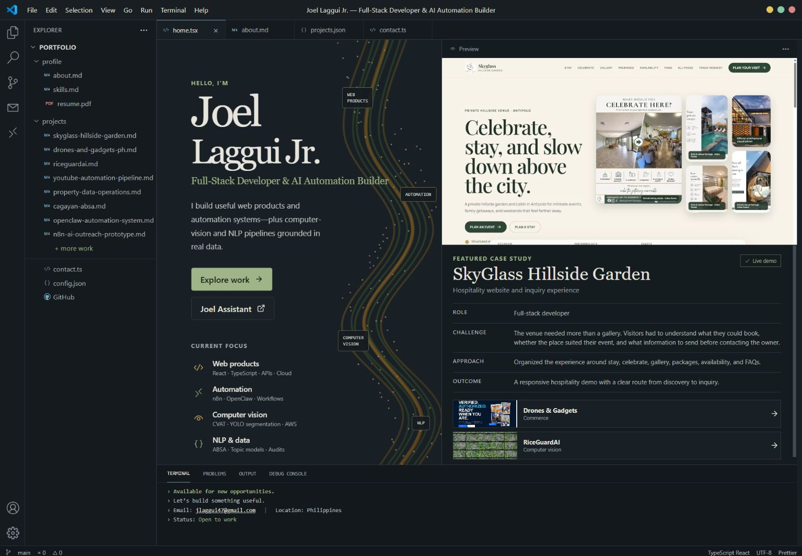

# Joel Laggui Jr. — Portfolio

A responsive VS Code-inspired portfolio for my full-stack development, AI automation, computer-vision, NLP, and data work.

[Live portfolio](https://joellaggui.vercel.app/) · [LinkedIn](https://www.linkedin.com/in/joellagguijr-dev/) · [GitHub](https://github.com/GITLAGGUI)



## What is included

- Evidence-led case studies with stable slug routes, screenshots, stack, role, constraints, process, and honest project status.
- Featured work covering SkyGlass, Drones & Gadgets PH, RiceGuardAI, short-video automation, property data operations, Cagayan ABSA, OpenClaw, n8n, ZM’s Place, and the TikTok LIVE Support Companion.
- A responsive VS Code shell with desktop, tablet, and mobile layouts.
- A lazy 3D home-page data ribbon with static and reduced-motion fallbacks.
- `Joel Assistant`, backed by a server-side Vercel function with a portfolio-grounded local fallback.
- Legacy numeric project-link redirects, internal editor scroll restoration, project filters, and accessible navigation.

Private data, credentials, real lead records, private handles, and unreleased research holdouts are intentionally excluded from the repository and screenshots.

## Local development

```bash
npm install
npm run dev
```

Quality checks:

```bash
npm run lint
npm run build
npm audit --omit=dev
```

Project content lives in [`src/data/projects.ts`](./src/data/projects.ts). The visual and interaction QA record is in [`design-qa.md`](./design-qa.md).

## Deployment

The site is configured for Vercel. SPA routes are handled in `vercel.json`, while `/api/assistant` remains a serverless endpoint.

The assistant reads its API credential only from the deployment environment. Do not add keys to source files or client-side variables.

```bash
vercel pull --yes --environment production
vercel build --prod
vercel --prod --yes
```

## Stack

React · TypeScript · Vite · React Router · React Three Fiber · Three.js · Vercel
